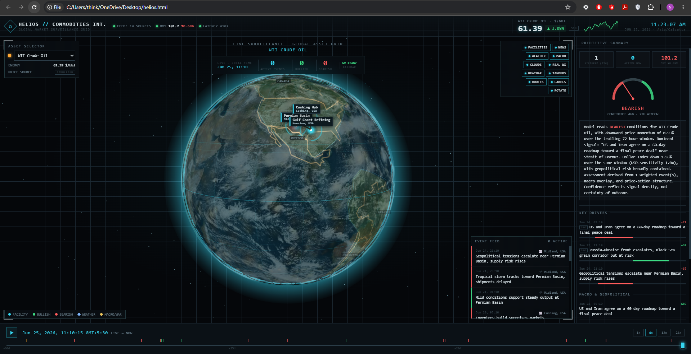

# HELIOS Backend — Live Data Service

<p align="center">
  
</p>

A small Flask + SQLite service that solves the one thing the static
`helios.html` frontend genuinely cannot do on its own: fetch live commodity
prices, weather, and the dollar index **without hitting CORS walls**.

Browsers block cross-origin `fetch()` calls to sites like Yahoo Finance,
Stooq, NSE, or MCX unless that site explicitly opts in with CORS headers —
most don't, by design, to stop exactly this kind of client-side scraping.
A Python process has no such restriction: this is a normal server-to-server
HTTP request, so it just works. That's the entire reason this service
exists — not because the logic is complicated, but because *where* the
request comes from matters.

## What it does

- Polls free, keyless sources on a timer and stores every reading in SQLite:
  - **Prices** — Yahoo Finance (primary), Stooq (fallback) for WTI, Brent,
    Henry Hub Nat Gas, Copper, Gold, Silver, Wheat, Coffee futures.
  - **Weather** — Open-Meteo, per production facility (lat/lon).
  - **Dollar Index (DXY)** — Yahoo Finance.
- Serves it all back over a small JSON REST API with CORS enabled, so the
  static frontend (or anything else) can call it directly.
- Every collector fails *gracefully* — a blocked/rate-limited/changed
  upstream source just gets skipped for that cycle and logged as a warning.
  Nothing crashes the scheduler.

## What it deliberately does NOT do

- **No historical backfill.** Free sources don't hand out 30 days of
  historical intraday commodity prices for nothing. Data starts
  accumulating from the moment you start running this service. If you want
  real history, you'll need a paid data vendor (e.g. Twelve Data, EOD
  Historical Data, Quandl/Nasdaq Data Link) — swap that in as another
  collector function in `collectors.py`, the rest of the pipeline doesn't
  care where a price came from.
- **No real news/AIS/satellite feed.** The `news_events` table and model
  are there as a place to put a real news API integration if you add one
  later (it isn't populated automatically by this scaffold). Live tanker
  tracking (AIS) and global cloud imagery both require either a paid API
  key or a registered free-tier account (e.g. aisstream.io) — neither is
  truly free/keyless the way Open-Meteo is, so they're out of scope here
  on purpose rather than faked.
- **Yahoo's endpoint is unofficial.** It's the same one many open-source
  tools (like `yfinance`) wrap. It can change shape or start rate-limiting
  without notice — that's the nature of free, undocumented APIs. Treat it
  as best-effort, same as everything else here.

## Setup

```bash
cd helios-backend
python3 -m venv venv
source venv/bin/activate        # Windows: venv\Scripts\activate
pip install -r requirements.txt
python app.py
```

The API is now at `http://localhost:5000`. SQLite file `helios.db` is
created automatically in this folder on first run.

Useful env vars (all optional, see `config.py`):

```bash
POLL_PRICE_MINUTES=5
POLL_WEATHER_MINUTES=15
POLL_MACRO_MINUTES=5
CORS_ORIGINS=*                  # tighten this to your real frontend origin in production
DISABLE_SCHEDULER=1             # run the API with no background polling (e.g. for tests)
```

## API

| Endpoint | Description |
|---|---|
| `GET /api/health` | liveness check |
| `GET /api/commodities` | list of tracked commodities |
| `GET /api/prices/<id>/latest` | most recent stored price tick |
| `GET /api/prices/<id>/history?hours=720` | stored price ticks in the window |
| `GET /api/weather/<facility_name>/latest` | most recent weather reading for a facility |
| `GET /api/macro/dxy/latest` | most recent Dollar Index reading |
| `GET /api/macro/dxy/history?hours=720` | DXY readings in the window |
| `GET /api/news?commodity_id=wti` | news/macro events (empty until you wire a collector) |

`<id>` is one of: `wti`, `brent`, `ng`, `cu`, `au`, `ag`, `wheat`, `coffee`
(matches the commodity IDs in `helios.html`).

## Wiring it into the frontend

In `helios.html`, the `refreshLivePrices()` / `fetchLivePrice()` and
`fetchLiveWeather()` functions currently call Stooq/Open-Meteo directly
from the browser. Point them at this service instead, e.g.:

```js
const API_BASE = 'http://localhost:5000';

async function fetchLivePrice(commodity) {
  try {
    const res = await fetch(`${API_BASE}/api/prices/${commodity.id}/latest`);
    if (!res.ok) return null;
    const data = await res.json();
    return data.price;
  } catch (e) { return null; }
}
```

Same pattern for weather and DXY. Once this backend is reachable, you get
real CORS-free data instead of best-effort browser fetches.

## Going to production

The built-in `python app.py` server is for local development only (it
says so when it starts). For anything real:

```bash
pip install gunicorn
gunicorn -w 2 -b 0.0.0.0:8000 app:app
```

Run it behind a reverse proxy (nginx/Caddy) with HTTPS, set `CORS_ORIGINS`
to your actual frontend domain (not `*`), and switch
`SQLALCHEMY_DATABASE_URI` to Postgres if you expect real concurrent load —
SQLite is fine for one writer (the scheduler) and light read traffic, which
is exactly this use case, but it's not the right choice if you outgrow that.
